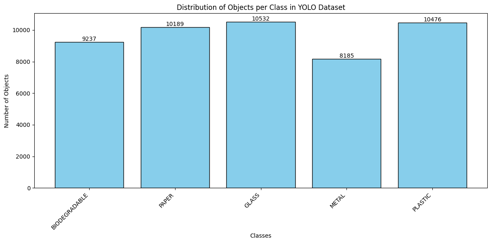

# Trashformer

Trashformer is a performance comparison study between YOLO26 and RT-DETR (Real-Time DEtection TRansformer) on a custom object detection dataset focused on waste classification.

## Overview

This project benchmarks two state-of-the-art object detection architectures—YOLO26 (CNN-based, single-stage) and RT-DETR (Transformer-based, end-to-end)—to evaluate accuracy, speed, and resource efficiency in practical waste detection scenarios.

## Models

### YOLO26
- Architecture: CNN-based single-stage detector
- Variants: TODO (e.g., n/s/m/l/x)
- Parameters: TODO (per variant)
- Input size: TODO
- Inference speed: TODO (ms/FPS on GPU)
- Head/blocks: TODO (e.g., C2f/C3k2, attention modules, SPPF)
- Notable features: TODO (e.g., NMS behavior, anchor-free/anchored heads, advanced augmentations)

Core design principles:
- Simplicity (end-to-end, NMS-free):
  - Produces predictions directly without Non-Maximum Suppression (NMS)
  - Faster, lighter inference and easier deployment
  - Approach pioneered in YOLOv10 (Ao Wang, Tsinghua University), further advanced in YOLO26
- Deployment efficiency:
  - Removes an entire post-processing stage from the pipeline
  - Lower latency and simpler, more robust integration across environments
- Training innovation (MuSGD optimizer):
  - Hybrid of SGD and Muon, inspired by Moonshot AI’s Kimi K2 LLM training breakthroughs
  - Improves stability and convergence; transfers optimizer advances from LLMs to CV
- Task-specific optimizations:
  - Segmentation: semantic segmentation loss and multi-scale proto modules
  - Pose: Residual Log-Likelihood Estimation (RLE) for high-precision keypoints
  - Oriented Bounding Boxes (OBB): optimized decoding with angle loss to resolve boundary issues


Reference: [Ultralytics YOLO26 docs](https://docs.ultralytics.com/models/yolo26/)

### RT-DETR
- Architecture: Transformer-based detector (end-to-end)
- Key features: Attention mechanism, NMS-free pipeline
- Strengths: Robustness in occlusions and complex scenes
- Training notes: Benefits from longer training schedules

## Dataset

- Classes: 5 waste categories
- Train: 11.879 images
- Val: 2,382 images
- Instances: 18,910 labeled objects
- Image size: 640×640
- Train ds Distribution: See 

## Training Configuration

### YOLO26
- Base model: yolo26l.pt (Large variant) [or specify variant used]
- Optimizer: Adam (lr=0.01, momentum=0.937)
- Epochs: 100 (patience=20)
- Batch size: 16
- Transfer learning: Freeze first 11 layers
- Augmentations: Mosaic, mixup, HSV shifts, geometric transforms

### RT-DETR
- Optimizer: SGD (lr=0.01, momentum=0.937)
- Epochs: 500
- Batch size: 64
- Weight decay: 0.0001
- Scheduler: Cosine annealing (cos_lr=True)
- Workers: 8

## Preliminary Results (YOLO26)

- Best recorded (Epoch 17):
  - mAP@50: 0.322
  - mAP@50–95: 0.179
  - Precision: 0.438
  - Recall: 0.332
- GPU: NVIDIA RTX 4070 Laptop GPU
- VRAM usage: ~5–6 GB
- Model summary: 357 layers, ~25.3M parameters

Add RT-DETR results here once training/evaluation is complete:
- TODO: mAP@50, mAP@50–95, precision, recall, FPS/latency

## Evaluation Metrics

- mAP@50, mAP@50–95
- Precision, recall
- Inference speed (FPS/latency)
- GPU memory usage
- Training time

## Repository Structure

```
Trashformer-/
├── train.ipynb              # Training workflows (YOLO26 & RT-DETR)
├── tryLive.ipynb            # Real-time inference comparison
├── dataset_distribution.png # Dataset class distribution
└── README.md                # Project documentation
```

## Requirements

- Python 3.12+
- PyTorch 2.6.0+ with CUDA
- Ultralytics >= 8.3.x
- NVIDIA GPU with 8GB+ VRAM recommended

## Getting Started

1. Install dependencies:
   ```
   pip install ultralytics torch
   ```
2. Train:
   - Open `train.ipynb`
   - Run YOLO26 training cell
   - Run RT-DETR training cell (longer schedule)
3. Compare live inference:
   - Open `tryLive.ipynb`

## Expected Insights

- Speed vs accuracy trade-offs (YOLO26 vs RT-DETR)
- Convergence behavior and resource costs
- Robustness to small/occluded objects and clutter
- Suitability for real-time vs offline pipelines

## Future Work

- Add RT-DETR results tables/plots
- Expand to more datasets and categories
- Quantization/ONNX/TensorRT deployments

- Compare with other families (YOLOv8/v11, DETR variants)

